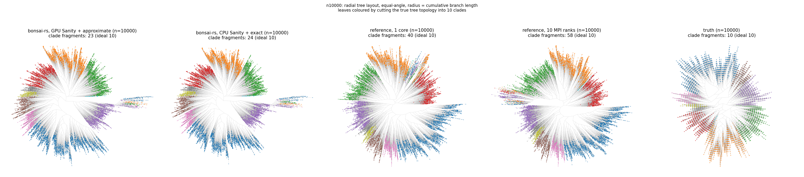
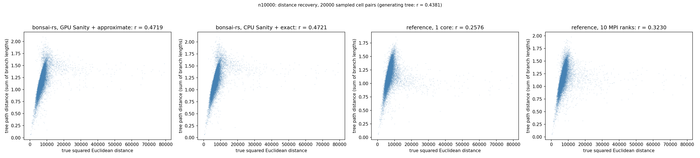
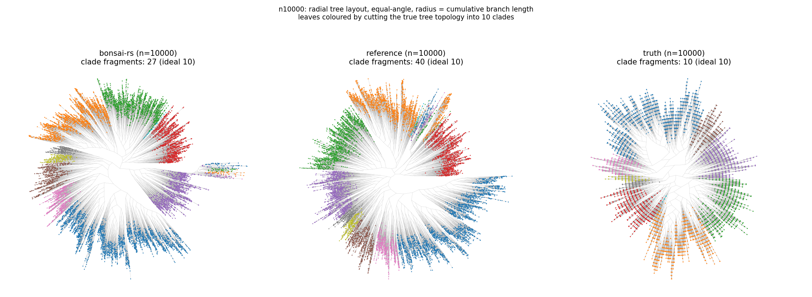
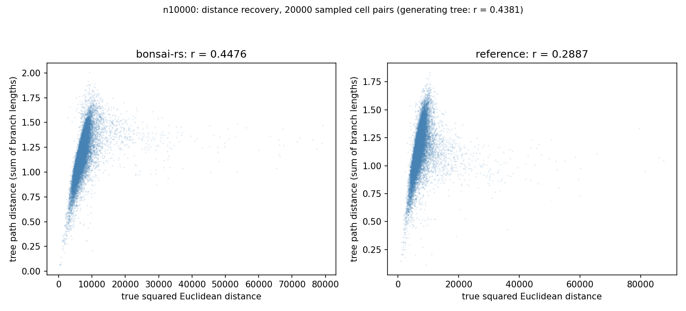
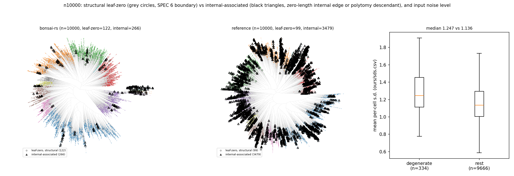

# Against the published implementation

Black-box comparison: same Sanity-preprocessed input to both, scored the same
way against a ground truth neither produced.

Every claim here rests on a measurement of inputs and outputs, or on the paper.
None rests on the published source, and none ever will;
[provenance](../PROVENANCE.md) says why.

## Setup

The harness lives outside this repository. It builds the input once and hands
the identical cells and genes to both. Reference trees are generated on demand,
never committed, on a private machine (which keeps NonCommercial out of it).

Data: Baron pancreas (GSE84133), Sanity on raw UMIs, same gene selection for
both. `512 s32` is the same 512 cells at another seed with a harder gene panel.

## Speed and quality

| cells | genes | method | seconds | Robinson-Foulds | distance recovery | loglikelihood, as given | loglikelihood, refit |
|---|---|---|---|---|---|---|---|
| 512 | 2,382 | bonsai-rs | 3.5 | 136 | 0.652 | -527,187 | -527,187 |
| 512 | 2,382 | published | 386 | 146 | 0.633 | -527,255 | -527,248 |
| 512 | 2,382 | truth | | 0 | 0.733 | | -528,223 |
| 512 s32 | 2,302 | bonsai-rs | 4.5 | 221 | 0.317 | -513,570 | -513,570 |
| 512 s32 | 2,302 | published | 368 | 240 | 0.303 | -513,553 | -513,536 |
| 512 s32 | 2,302 | truth | | 0 | 0.500 | | -515,853 |
| 5,000 | 2,701 | bonsai-rs | 53 | 1,301 | 0.667 | -5,557,888 | -5,557,888 |
| 5,000 | 2,701 | published | 4,868 | 1,937 | 0.496 | -5,563,770 | -5,561,535 |
| 5,000 | 2,701 | published, backbone 2,048 | 2,514 | 1,899 | 0.578 | -5,571,002 | -5,565,342 |
| 5,000 | 2,701 | published, backbone 1,000 | 1,794 | 1,959 | 0.569 | -5,572,684 | -5,566,018 |
| 5,000 | 2,701 | truth | | 0 | 0.679 | | -5,571,449 |
| 10,000 | 2,767 | bonsai-rs | 144 | 2,612 | 0.386 | -11,253,773 | -11,253,773 |
| 10,000 | 2,767 | published | 16,062 | 5,149 | 0.281 | -11,280,721 | -11,274,900 |
| 10,000 | 2,767 | published, backbone 2,048 | 3,529 | 3,946 | 0.368 | -11,280,324 | -11,264,651 |
| 10,000 | 2,767 | published, backbone 1,000 | 3,594 | 4,191 | 0.347 | -11,284,311 | -11,268,274 |
| 10,000 | 2,767 | truth | | 0 | 0.461 | | -11,282,910 |

bonsai-rs is `BonsaiParams::default()` in 0.2.0, 2026-09-26. Published is its
standard run on one core; the published backbone is its backbone-based mode
with `n_initial_cells` 2,048 or 1,000 and `growth_factor_guide` 10, one
process. Its default of 10,000 initial cells needs more cells than these sets
have.

Robinson-Foulds is to the generating tree, lower is better. Distance recovery
correlates tree path distance with true squared Euclidean distance (the paper's
Fig. S8), higher is better; the truth row is the ceiling for Robinson-Foulds,
and recovery can pass it (last bullet).

**Two loglikelihood columns, both from our scorer on the same data**, so the
dropped constants are the same and the numbers line up. What differs is the
branch lengths:

- *As given* scores each tree with its own branch lengths. The published
  implementation fitted its lengths to its own preprocessing, so for its trees
  this column mixes the topology with that mismatch.
- *Refit* first optimises the branch lengths of each topology on this data with
  our global solve (search steps 4 and 7), then scores. That compares the
  topologies alone, and it is the column to read. bonsai-rs doesn't move,
  because its lengths already are that optimum. The truth has no as-given value:
  its lengths are expected displacements in simulation units.

Higher is better, but the truth is no ceiling here. A maximum-likelihood tree
fits the noise that was realised, so both searches score above the true
topology. The loglikelihood is what the search optimises; Robinson-Foulds and
recovery are what it's for.

- **512 is a tie.** 136 splits against 146, recovery 0.652 against 0.633, 61
  nats ahead after the refit. The replicate flips it: 221 against 240 and 0.317
  against 0.303, but 34 nats behind.
- **From 5,000 bonsai-rs pulls ahead**, and at 10,000 by a lot: 2,612 against
  5,149 splits, 21,000 nats after the refit.
- **The refit matters for the published trees.** It recovers 2,200 nats at 5,000
  and 5,800 at 10,000; 15,700 for the 10,000 backbone. The as-given column
  overstates bonsai-rs's lead by 60 per cent at 5,000 and 28 at 10,000.
- **The published backbone pays off in the published implementation**: 2 to 4.5
  times faster than its standard run, and at 10,000 better on splits and on the
  refit loglikelihood. It is still 25 times slower than bonsai-rs's standard run
  at 10,000 and behind it on every column.
- **The two trees differ from each other** by 26, 111, 1,472 and 4,285 splits.
  Equal scores against the truth don't mean the same tree.
- **The published implementation is deterministic.** A 2026-09-14 rerun gave
  byte-identical Newick at all four sizes. Wall times moved under half a per
  cent where the first run had an idle machine, 30 per cent at 512 and 8 at
  10,000 where it hadn't.
- **Recovery at 10,000 depends on SPR's candidate order.** 0.2.0 re-applies the
  rest of a chunk after an acceptance (`SprApprox::recheck`) and lands at 0.386;
  with that off the same data gives 0.476, and random candidate orders alone
  span 0.40 to 0.48 ([performance](PERFORMANCE.md#how-much-one-real-data-run-says)).
  Recovery above the truth's 0.461 is possible because the truth's branch
  lengths are expected displacements and ours are fitted to what was realised.

## Counts to tree

Raw UMIs to finished tree, 2026-09-25, on **one node**: ten-core M1 Max, 64 GB,
each run alone. The published implementation can run MPI across nodes; nothing
here speaks to a cluster.

Data: the harness's simulated Baron counts, 17,499 genes. Original route: the
Sanity binary (10 threads, `-v_m MAP`), the harness's selection at `S >= 1`,
then published Bonsai on one core and under MPI with 10 ranks. Rust route:
`sanity-sc-rs` on CPU or GPU in `f32`, `from_sanity_output`, `bonsai()` at
defaults (also `S >= 1`). Rust Sanity's default `marginalise` variance rule does
more work per gene than `MAP`.

Sanity, seconds:

| cells | original | Rust, CPU | Rust, GPU |
|---|---|---|---|
| 512 | 71.9 | 29.7 | 0.5 |
| 512 s32 | 72.1 | 29.5 | 0.5 |
| 5,000 | 766.9 | 284.8 | 3.4 |
| 10,000 | 1,604.7 | 555.9 | 6.6 |

Bonsai, seconds:

| cells | published, 1 core | published, 10 ranks | Rust, exact search | Rust, approximate search |
|---|---|---|---|---|
| 512 | 371.7 | 170.2 | 4.2 | 3.5 |
| 512 s32 | 371.0 | | 5.4 | 3.8 |
| 5,000 | 4,868 | 3,208.6 | 117.2 | 60.4 |
| 10,000 | 16,062 | 9,439.3 | 631.0 | 177.1 |

Exact is SPR and NNI as the paper specifies them; approximate is the default
(see the README). Rust search times are on CPU-Sanity input. On GPU-Sanity
input, exact took 151.8 s and 740.9 s at 5,000 and 10,000, approximate 61.1 s
and 172.8 s: the search path depends on the posteriors. Published single-core
times at 5,000 and 10,000 are the harness's, reproduced within half a per cent
on 2026-09-14; the rest are reruns. The original route also spends 2.0, 0.8,
29.7 and 66.5 s on gene selection, included below.

End to end, seconds:

| cells | original, 1 core | original, 10 ranks | Rust CPU + exact | Rust GPU + approximate | speed-up over the original on 1 core / 10 ranks |
|---|---|---|---|---|---|
| 512 | 445.6 | 244.1 | 34.1 | 3.8 | 117x / 64x |
| 512 s32 | 443.9 | | 34.7 | 4.3 | 103x / |
| 5,000 | 5,664.2 | 4,005.2 | 400.0 | 64.9 | 87x / 62x |
| 10,000 | 17,733.2 | 11,110.5 | 1,184.4 | 180.4 | 98x / 62x |

Quality against the generating tree. Recovery here uses all 17,499 genes' true
positions, not the selected genes of the headline table:

| cells | original, 1 core | original, 10 ranks | Rust CPU + exact | Rust GPU + approximate |
|---|---|---|---|---|
| 512 | RF 146, 0.492 | RF 141, 0.496 | RF 136, 0.632 | RF 137, 0.632 |
| 512 s32 | RF 240, 0.165 | | RF 244, 0.232 | RF 237, 0.233 |
| 5,000 | RF 1,937, 0.352 | RF 2,016, 0.261 | RF 1,285, 0.451 | RF 1,277, 0.572 |
| 10,000 | RF 5,149, 0.162 | RF 5,151, 0.226 | RF 2,607, 0.388 | RF 2,627, 0.386 |

Published memory, peak RSS summed over processes: 543 MB, 2,965 MB, 5,686 MB at
512, 5,000, 10,000 on one core; 3,009 MB, 10,033 MB, 18,737 MB with 10 ranks.
That's 5.5, 3.4 and 3.3x the memory for 2.2, 1.5 and 1.7x the speed, one Python
process per rank. MPI also changes its answer: RF 141 against 146 at 512, 2,016
against 1,937 at 5,000, 5,151 against 5,149 at 10,000.

Two cautions. Differences between the Rust Sanity paths and search modes sit
inside the run-to-run spread ([performance](PERFORMANCE.md#how-much-one-real-data-run-says)): 0.45 against 0.57 at 5,000 is two basins, not the GPU
making better trees. The gaps to the published trees, hundreds to 2,500 splits,
are far outside it.

Same trees drawn as in [What the trees look like](#what-the-trees-look-like):
clade fragments (ideal ten) and recovery on the selected genes, same 20,000
pairs for every tree.

| cells | GPU + approximate | CPU + exact | reference, 1 core | reference, 10 ranks |
|---|---|---|---|---|
| 512 | 13, 0.745 | 13, 0.744 | 15, 0.638 | 14, 0.643 |
| 512 s32 | 17, 0.375 | 17, 0.373 | 19, 0.311 | |
| 5,000 | 23, 0.674 | 23, 0.592 | 29, 0.500 | 36, 0.402 |
| 10,000 | 23, 0.472 | 24, 0.472 | 40, 0.258 | 58, 0.323 |

## What the trees look like

Equal-angle radial layout, radius is branch length from the root. Leaves are
coloured by cutting the *true* tree into ten clades, so a colour marks the same
cells in every panel.

**Clade fragmentation** counts same-colour runs around the circle, ideal ten. An
intact clade is one run; a broken one is several. Cheap, and it catches things
neither Robinson-Foulds nor the loglikelihood does.

| config | bonsai-rs | published |
|---|---|---|
| 512 | **14** | 15 |
| 512 s32 | **17** | 19 |
| 5,000 | **22** | 29 |
| 10,000 | **26** | 40 |

bonsai-rs wins at every size, including the two where it's level or behind on
the headline metrics, and the gap grows from one fragment at 512 to fourteen at
10,000.

Path distance against true squared Euclidean distance, the same 20,000 random
pairs in both panels. Same shape in both: tight near-linear at small distances,
plateau at large ones (path distance is bounded by the tree's diameter). The
correlation gap is a wider spread everywhere, not a few stray pairs.

## Degenerate branches

| tree | zero-length leaf edges | zero-length internal edges | polytomies |
|---|---|---|---|
| bonsai-rs 512 | 0 | 0 | 3 |
| bonsai-rs 512 s32 | 8 | 0 | 3 |
| bonsai-rs 5,000 | 51 | 0 | 17 |
| bonsai-rs 10,000 | 129 | 0 | 40 |
| published 512 | 0 | 0 | 3 |
| published 512 s32 | 5 | 0 | 7 |
| published 5,000 | 40 | 0 | 107 |
| published 10,000 | 99 | 0 | 335 |

Two different things; don't conflate them.

**Zero-length leaf edges** are a SPEC 6 boundary optimum: no evidence separating
the cell from its parent. Intended, and about input noise, not topology. The
generating tree has none. These cells are a bit noisier: median per-cell SD 1.25
against 1.14 at 10,000.

**Zero-length internal edges and polytomies** come from SPR and NNI splices.
Step 8 takes the internal count to zero everywhere (28 at 10,000 before it
existed; they appear after step 5, 32 at 10,000). Leaf edges it leaves alone by
design.

Both now have zero internal ones, so the difference is in the leaf edges and in
how much tree sits under a multifurcation: 34.9 per cent degenerate leaves at
10,000 for the published tree against 4.7, a largest multifurcation of 513
leaves against 253, and 335 polytomies against 40.

## Fans and ladders

Both implementations hit groups of cells the data can't order: the evidence
separating them is weaker than the noise. **How they write that down is the
biggest reason the pictures look different.**

The reference draws a **fan**: the whole group as siblings off one node. At
10,000 cells, 335 multifurcations, the largest 513 leaves.

bonsai-rs draws a **ladder**: an order anyway, each cell on its own small,
non-zero branch. 40 multifurcations, the largest 253.

In a radial layout, radius is the sum of branch lengths above a leaf. A fan adds
nothing and lands as a blob. A ladder adds up (28 hops, median radius 0.967
against the tree's typical 0.621) inside one thin angular slice. Long and thin
is a spike. The reference's picture is tidier because it flattened those cells,
not because it placed them better.

**The ladder is more faithful, most of all exactly where a fan looks
defensible.** Pearson correlation of true squared distance with path distance
at 10,000 cells (`faithfulness.py` in the harness). The subset rows use every
pair; the first samples 200,000, which is why it isn't that tree's 0.466
(the 2026-09-13 run; the table above is 0.2.0).

| pairs drawn from | cells | in bonsai-rs's tree | in the reference's tree |
|---|---|---|---|
| all cells | 10,000 | 0.470 | 0.278 |
| the cells bonsai-rs strings into its longest ladder | 250 | 0.604 | 0.576 |
| the cells the reference fans into its largest multifurcation | 513 | 0.127 | 0.004 |

- **A multifurcation isn't declining to answer.** It claims every member is
  equidistant from every other, and carries no distance information: 0.004 is
  zero. The ladder still gets 0.127 on the same cells.
- **The ladder's order isn't noise.** 0.604 on the spike's 250 cells, above its
  own whole-tree 0.470 and the reference's 0.576 there. An arbitrary order would
  score near zero, like the fan.
- **So the spike is a feature** for anyone reading distances off the picture.
  Flattening it would force a fan where the branch solve found positive optima.

Limits: path distance saturates at large true distances in both trees, and at
10,000 cells the generating tree only scores 0.461, so there's little global
headroom either way.

## The arm

**Measured on the 2026-09-13 trees, since replaced by the start change. The
spike is still there with the same shape; the per-cell claims below haven't been
re-derived and one already doesn't carry over.** On the current 10,000-cell
tree the tail is 250 leaves (was 241), median 28 hops against 17, radius 0.967
against 0.621. But only 12 of its 129 zero-length leaf edges fall in it, against
75 of 122 below. Either that concentration is gone or the radius cut isn't the
clade definition used here; not yet separated.

The spike is one clade: 241 cells at 10,000, 112 at 5,000.

- **Not a misplaced clade.** In the generating tree those 241 cells spread over
  seven of the ten top-level clades, none holding a third. At 5,000, nine of ten.
  There's no true group to misplace.
- **The reference builds the same group.** 217 of the 241 sit in one reference
  clade of 520 leaves; at 5,000, 94 of 112 in one of 176. Independent agreement:
  a property of the data.
- **These are the cells the model won't separate.** 75 of 241 have a zero-length
  branch, 61 per cent of all zero-length leaf edges from 2.4 per cent of cells.
  66 of the reference's 99 are arm cells too; 82 cells are flagged by both.
- **Not just the noisiest cells.** Median SD 1.195 against 1.138; noisiest
  decile 12.0 against 9.9 per cent; at 5,000 no enrichment at all. What puts a
  cell here is its mean sitting close to its neighbours relative to its error
  bars.

Step 8 doesn't touch it: internal zero-length edges 32 to 0, arm radius 0.902
to 0.902. The chain is small *positive* edges.

## Honest rendering

These figures never jitter coincident points apart. A leaf at zero distance from
its parent drawn anywhere else manufactures structure the model said it couldn't
find. Overlapping markers at equal radius are zero-length leaf edges, not a
glitch, and seven times as many of the published tree's leaves are affected.

The same goes the other way for the spike. It's ugly and someone will ask to
collapse it. That would replace measured positive branch lengths with a
multifurcation, which carries no distance information. Tidying the picture would
delete the part that's true.

## Reproducing

`reference/comparison/` has the harness: the Baron count simulator, Sanity and
gene selection, the scorer, and every figure and table script here.
`faithfulness.py` makes the recovery table, `degeneracy.py` the zero-length
counts, `figures.py` the layouts, scatters and fragmentation. Its README has
the commands.

What it leaves out is running the published implementation. Get a tree from it
by its own documentation on the same Sanity output, save it as `theirs.nwk` in
the configuration, and `harness score` puts it next to ours.
