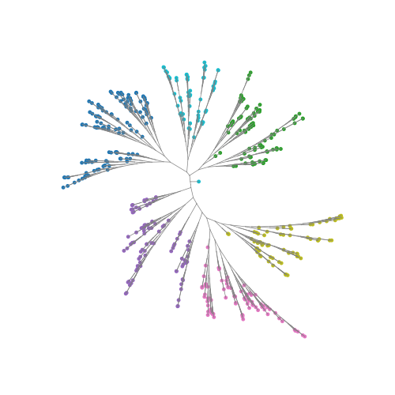

# Quickstart

Everything below runs on the simulators in `bonsai_rs.datasets`, so every
answer can be checked against the tree that generated it. The printed numbers
are real output.

## From raw counts

The path for scRNA-seq. `bonsai_from_counts` runs Sanity, converts its
posteriors into likelihood parameters and runs the search, all in Rust.

```python
import bonsai_rs as bs

sim = bs.datasets.simulate_counts(256, 500, seed=0)  # cells x genes, int64
res = bs.bonsai_from_counts(sim.counts, cell_totals=sim.cell_totals)

res.tree.n_leaves, res.tree.n_nodes  # (256, 511)
len(res.features), len(res.dropped)  # (487, 11)
bs.robinson_foulds(res.tree, sim.tree)  # 0
```

`counts` is anything cells x genes: a dense integer array, or any scipy sparse
matrix or array. `cell_totals` is each cell's UMI total over **all** genes. Leave
it out and the row sums of `counts` are used, which is right only when `counts`
holds every gene. Subset to highly variable genes first and you must pass the
totals from the full matrix.

`res.dropped` is the genes the Sanity conversion refused, and `res.features`
the ones the search used, both as column indices into `counts`. The
[guide](guide.md#the-sanity-handover) says why genes get dropped.

`res.steps` records what each stage of the search bought:

```python
for s in res.steps:
    print(f"{s.step:<12} {s.loglik:10.1f} {s.gain:8.1f}")
```

```text
1-2 linkage    -82879.0      0.0
3 polytomy     -82879.0      0.0
4 branch       -33832.2  49046.7
5 spr          -33697.4    134.8
6 nni          -33697.4      0.0
7 branch       -33649.4     48.0
8 collapse     -33649.4      0.0
```

A step with zero gain found nothing to improve, which is fine. A negative gain
would be a bug worth reporting.

## One step at a time

Same thing, split so you can keep the Sanity output around:

```python
post = bs.sanity(sim.counts, cell_totals=sim.cell_totals)
lik = bs.from_sanity(post.log_fold_changes, post.error_bars, post.variance)
res = bs.bonsai(lik.means, lik.sds, variances=lik.variances)
```

This gives the identical tree and loglikelihood. `post.log_transcription_quotients`
is the normalised expression matrix if you want one for anything else. Don't
feed it to `from_sanity`; see the [guide](guide.md#the-sanity-handover).

## From your own means and error bars

Any per-cell, per-feature measurement with a standard deviation on it works.

```python
d = bs.datasets.simulate(512, 200, kind="unbalanced", seed=3)
res = bs.bonsai(d.means, d.sds)

bs.robinson_foulds(res.tree, d.tree)  # 2, of a possible 1018
```

`variances` is optional here. Without it, the per-feature variance is estimated
from the data (SI eq. S9). Storage follows the input: hand in `float32` and it
stays `float32` all the way down, with every reduction in `float64` regardless.

## Drawing it

`layout` gives node coordinates; edges run from every node to its parent.
matplotlib is not a dependency, bring your own.

```python
import matplotlib.pyplot as plt
import numpy as np

xy = bs.layout(res.tree)  # equal daylight, the default
clusters = bs.cluster(res.tree, 6)

child = np.flatnonzero(res.tree.parent >= 0)
parent = res.tree.parent[child]
n = res.tree.n_leaves

fig, ax = plt.subplots(figsize=(5, 5))
ax.plot(
    np.stack([xy[child, 0], xy[parent, 0]]),
    np.stack([xy[child, 1], xy[parent, 1]]),
    color="grey",
    lw=0.5,
)
ax.scatter(xy[:n, 0], xy[:n, 1], c=clusters.leaf_cluster, s=6, cmap="tab10")
ax.set_aspect("equal")
ax.axis("off")
```



`kind="angle"` is the cruder, faster radial layout and `kind="dendrogram"` the
classic one. `hyperbolic=True` projects onto the Poincare disk, which gives the
crowded outer branches more room.

## Getting the tree out

```python
newick = bs.to_newick(res.tree, labels=cell_names)
tree, labels = bs.read_newick(newick)
```

`read_newick` numbers leaves in order of appearance, so use the returned labels
to map back. `tree_distances(res.tree)` gives the full leaf-by-leaf path
distance matrix; pass `pairs` for a sample on anything large.
